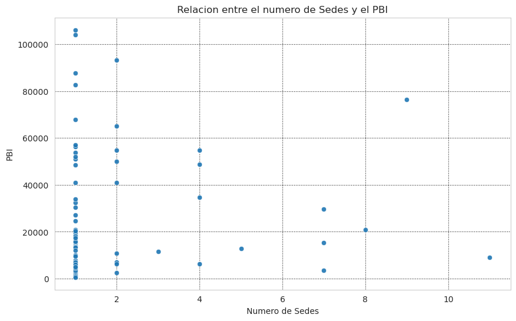

# Estudio de la relación PBI - Embajadas

## Resumen

En este trabajo nos propusimos entender la relación entre el PBI per cápita de un país y la cantidad de sedes que Argentina tiene en dicho país. Para ello hemos recopilado tablas púbicas que contengan datos acerca del PBI de los países del mundo como también información sobre ellos, por ejemplo la región a la que pertenecen, y también información acerca de las sedes que Argentina tiene en el mundo. A partir de éstas tablas hemos hecho un análisis exploratorio de estas como así de la calidad de los datos y, en consecuencia, una limpieza de los atributos que consideramos clave a la hora de analizar esta relación. Hemos generado un Modelo Entidad-Relación y su respectivo DER (Diagrama de Entidad Relación) Luego creamos dataframes vacíos que corresponden al DER, y por último hemos importado los datos que consideramos relevantes.
A partir de estos datos, utilizamos SQL para generar reportes que muestran distintas relaciones entre los países, el PBI, su región y las redes que utilizan para su comunicación como también gráficos que nos ayudaron a visualizar y entender la información que hemos recopilado y limpiado.
Por último llegamos a la conclusión que a pesar que el PBI per cápita es un factor importante a la hora de analizar la cantidad de sedes de un país, esta relación no es lineal y no es el único factor relevante para entender la relación entre la cantidad de sedes que tiene un país.

## Contenido del repositorio

- Tablas originales públicas descargadas.
- Tablas propias generadas en 3ra forma normal con los datos necesarios para la realización del trabajo.
- Reportes generados con `SQL` para comprender y analizar la relación entre las tablas propias.
- Un informe en .pdf donde se detalla el trabajo realizado, se muestran los reportes, los gráficos y la conclusión.
- Imagenes de los gráficos del informe.
- Archivo `main.py` donde se encuentra todo el código utilizado para limpiar las tablas originales, generar las tablas, los reportes, y los gráficos.

## Graficos y recortes de las tablas generadas con SQL

### Bar Chart

<!--  -->

### Box Plot

<!--  -->

### Scatter Plot

<!--  -->

### Recortes de tablas generadas con SQL (Tablas Limpias)

#### Tabla 2

|Region                    |Paises_con_sedes_Argentinas|PBI_promedio_U$S  |
|--------------------------|---------------------------|------------------|
|North America             |2                          |65623.62239391456 |
|Europe & Central Asia     |26                         |37916.702419266076|
|East Asia & Pacific       |11                         |27876.872316966474|
|Middle East & North Africa|12                         |24902.5189234891  |
|Latin America & Caribbean |24                         |11877.417324235066|
|Sub-Saharan Africa        |7                          |2459.067444021032 |
|South Asia                |3                          |2229.3577834684565|

#### Tabla 4

|Pais                          |Sede|Red_Social        |URL             |
|------------------------------|----|------------------|----------------|
|Paraguay                      |CASUN|Instagram         |@ArgentinaEnAsuncion|
|Brazil                        |CFLOR|Instagram         |@argenflorianopolis|
|United States                 |CHOUS|Instagram         |@ARGenHouston   |
|United States                 |CLANG|Instagram         |@arg_clang      |
|United States                 |CMIAM|Instagram         |@argenmiami     |
|Brazil                        |CPABL|consuladoargentinosp@gmail.com|consuladoargentinosp@gmail.com|
|Italy                         |CROMA|Instagram         |@ArgEnRoma      |
|Italy                         |CROMA|Instagram         |@consuladoargentinoenroma|

## Para ejecutar el código

Utilizamos las librerías `pandas`, `inline_sql`, `matplotlib` y `seaborn`. Recomendamos instalar el gestor de paquetes y entornos [Conda](https://docs.conda.io/en/latest/) y crear un enviroment para este proyecto. Luego ejecutar el comando `conda activate <tu-enviroment>` (reemplazar `<...>` por el nombre) y luego `conda install <nombre-libreria>` y en el caso de inline_sql `pip install inline_sql`. Finalmente `python3 main.py` o ir ejecutando celda por celda separadas en el archivo por `#%%`.
